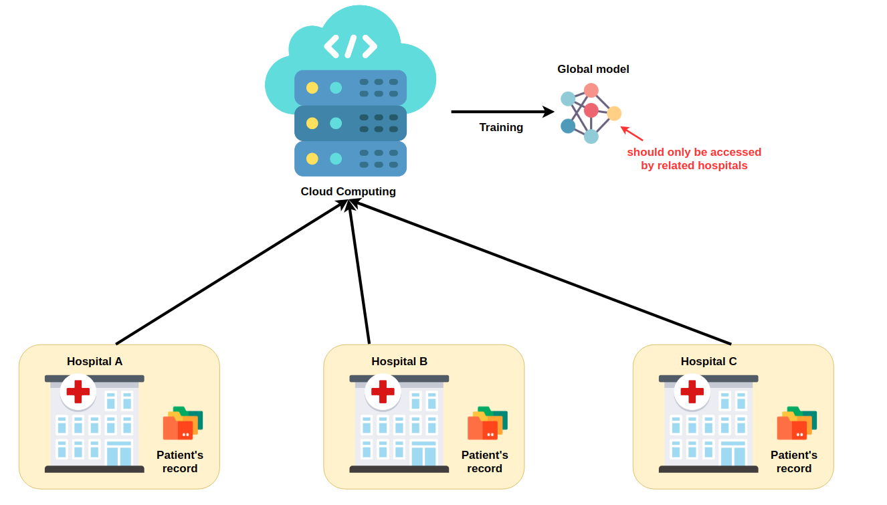
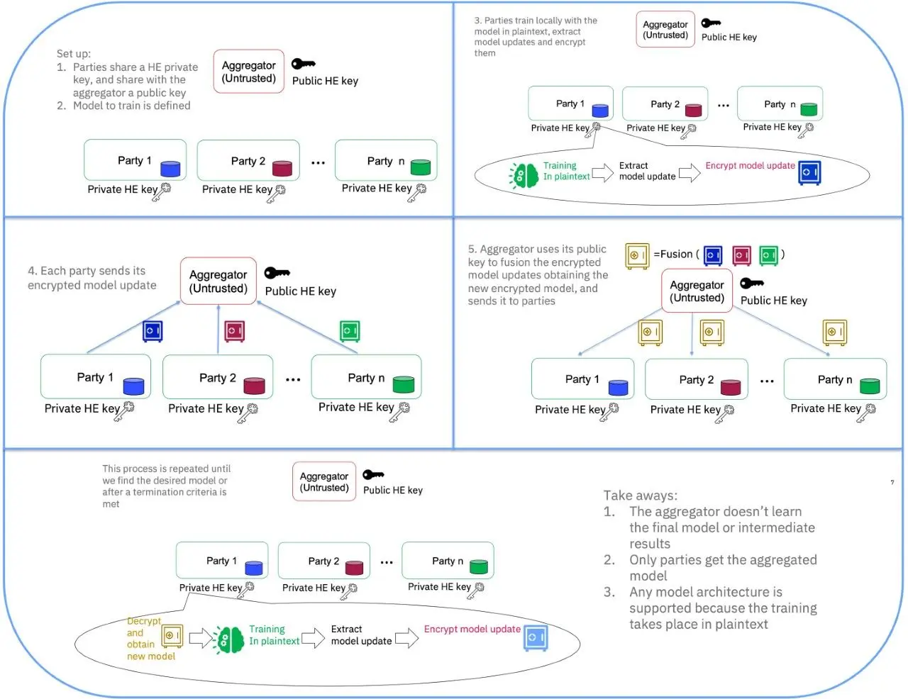
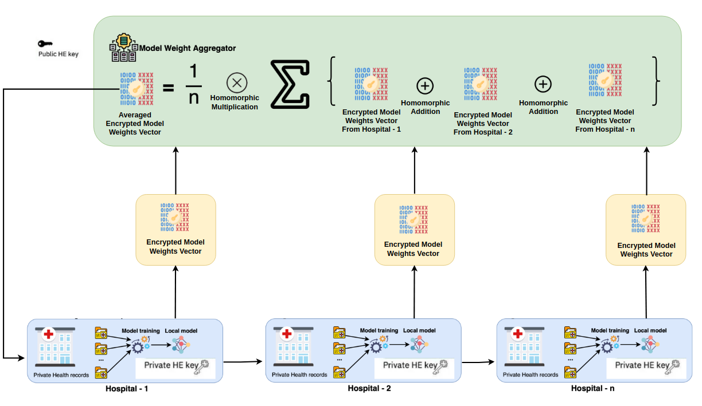

# Homomorphic Encryption and Federated Learning based Privacy-Preserving: Breast cancer detection Use-Case

## Abstract

This project proposes a privacy-preserving federated learning algorithm for medical data using homomorphic encryption. The proposed algorithm uses a secure multi-party computation protocol to protect the machine learning model from the adversaries. In this study, the proposed algorithm using a real-world medical dataset is evaluated in terms of the model performance.

## Scenario

- There are several different hospitals that want to collaborate to train a global machine learning model to do breast cancer classification. 
- However, for privacy preserving, hospitals do not want to share their data with each other.​ 
- They also don't want to centralize all of their original data for cloud computing (semi-trusted party).
- Only related parties can get acess to global model (even cloud computing can not do that).

    

## Proposed solution

### How to solve decentralized data challenge in machine learning?

Federated learning (also known as collaborative learning) is a machine learning technique that trains an algorithm via multiple independent sessions, each using its own dataset. This approach stands in contrast to traditional centralized machine learning techniques where local datasets are merged into one training session, as well as to approaches that assume that local data samples are identically distributed

    

### How to protect global model from untrusted-cloud server?

We use homomorphic encryption scheme that will enable cloud computing perform federated-learning algorithm on encrypted local models value with public key provided by hospitals to produce encrypted global model. And only the hospital, who have the private key that can decrypt and extract the final global model.

For more detail, you can see [here](https://research.ibm.com/blog/federated-learning-homomorphic-encryption)

    

### Introducing our proposed system

This is our proposed system to combine federated learning with homomorphic encryption.

    

There are some clear advantages with this approach:

- The aggregator doesn’t get access to any of the model updates => preventing potential inference attacks. ​

- Only hospitals get access to global models, preventing any model steal attack from the aggregator.​

- The hospitals operate over the plain-text model, so the type of model we can train is not restricted.​

## Implementation Plan

|   Tools and resources                                                  | Description                                      |
| :--------------------------------------------------------------------: | ------------------------------------------------ |
| [kaggle](https://www.kaggle.com/datasets/yasserh/breast-cancer-dataset)| Open source datasets                             |
| [PyTorch](https://github.com/pytorch/pytorch)                          | Python framework for machine learning            |
| [openFHE](https://github.com/openfheorg/openfhe-development)           | Open-Source Fully Homomorphic Encryption Library | 
| linux                                                                  | This project demo on linux environment           | 

## References

- [1] Wibawa, F., Catak, F. O., Kuzlu, M., Sarp, S., & Cali, U. (2022, June). Homomorphic encryption and federated learning based privacy-preserving cnn training: Covid-19 detection use-case. In Proceedings of the 2022 European Interdisciplinary Cybersecurity Conference (pp. 85-90).​

- [2] Al Badawi, A., Bates, J., Bergamaschi, F., Cousins, D. B., Erabelli, S., Genise, N., ... & Zucca, V. (2022, November). OpenFHE: Open-source fully homomorphic encryption library. In Proceedings of the 10th Workshop on Encrypted Computing & Applied Homomorphic Cryptography (pp. 53-63).

- [3] Kim, A., Song, Y., Kim, M., Lee, K., & Cheon, J. H. (2018). Logistic regression model training based on the approximate homomorphic encryption. BMC medical genomics, 11(4), 23-31.